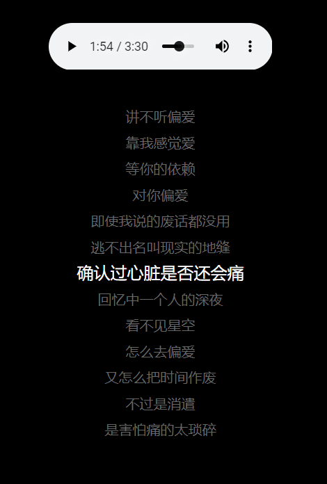

<p>
  
  
  
  
  <a target="_blank" href="https://gitee.com/OlinOnee">
    
  </a>
</p>

# frontend-music-lrc-scroll-sample

**中文** | [English](./README.en.md)

## 项目相关

### 项目介绍

一个基于原生方式（HTML+CSS+JS）实现的歌词滚动效果案例。目前项目托管在 Gitee 和 Github 平台上中，欢迎大家 Star 和 Fork 支持~

### 项目目录

```shell
frontend-music-lrc-scroll-sample
└─src
    ├─assets
    │  └─audio
    │      ├─cover
    │      ├─lyric
    │      └─sources
    ├─css
    ├─doc
    └─js
```

### 项目效果





### 项目地址

目前项目托管在 Gitee 和 Github 平台上中，欢迎大家 Star 和 Fork 支持~

- Gitee：[https://gitee.com/OlinOnee/frontend-music-lrc-scroll-sample](https://gitee.com/OlinOnee/frontend-music-lrc-scroll-sample)
- Github：[https://github.com/micro-carving/frontend-music-lrc-scroll-sample](https://github.com/micro-carving/frontend-music-lrc-scroll-sample)

## 参与贡献

开源项目离不开大家的支持，如果您有好的想法，遇到一些 **BUG** 并修复了，欢迎小伙伴们提交 **Pull Request** 参与开源贡献

1. **fork** 本仓库到自己的 **repo**
2. 将自己的 **repo** 项目 **clone** 到本地
3. 新建 **feat_xxx** 分支
4. 新增或者修改代码
5. **commit** 并 **push** 到自己的 **repo**
6. 新建 **PR** (**Pull Request**) 请求，提交到 develop 分支
7. 等待作者合并

## Git 贡献提交规范
- 参考 vue 规范 (Angular)
    - 🆕 `feat` 增加新功能
    - 🐞 `fix` 修复问题/BUG
    - 🧽 `polish` 打磨功能，用优雅的方式改造功能
    - 📝 `docs` 文档/注释
    - 🎨 `style` 代码风格相关无影响运行结果的
    - 🧬 `refactor` 重构
    - 📈 `perf` 优化/性能提升
    - 🎬 `test` 测试相关
    - 🔙 `revert` 撤销修改
    - 〰 `workflow` 工作流改进
    - 🛠 `ci` 持续集成
    - 🆒 `chore` 依赖更新/脚手架配置修改等
    - 💱 `types` 类型定义文件更改


## 开源协议

1. [GPL 3.0(GNU General Public License Version 3)](https://www.gnu.org/licenses/gpl-3.0.txt)，GNU通⽤公共许可协议。GNU官⽅的定义：GNU is
   Not Unix
2. GPL 3.0协议第4条、第5条的规定，只要后续版本中有使⽤先前开源版本中的源代码，并且先前版本使⽤了GPL 3.0协议，则后续版本也必然受GPL 3.0协议的约束。
3. GPL 3.0协议并未限制⽤户进⾏商⽤，只是必须遵守开源的规定。GPL的精髓就是开源，和是否商⽤，是否收费完全没有关系。
4. GPL 其实从字⾯上就可以理解为公共许可证，也就是说遵循GPL的软件是公共的，其实不存在什么版权问题，或者说公众都有版权，GPL提出了和版权 （copyright）完全相反的概念（copyleft）。
